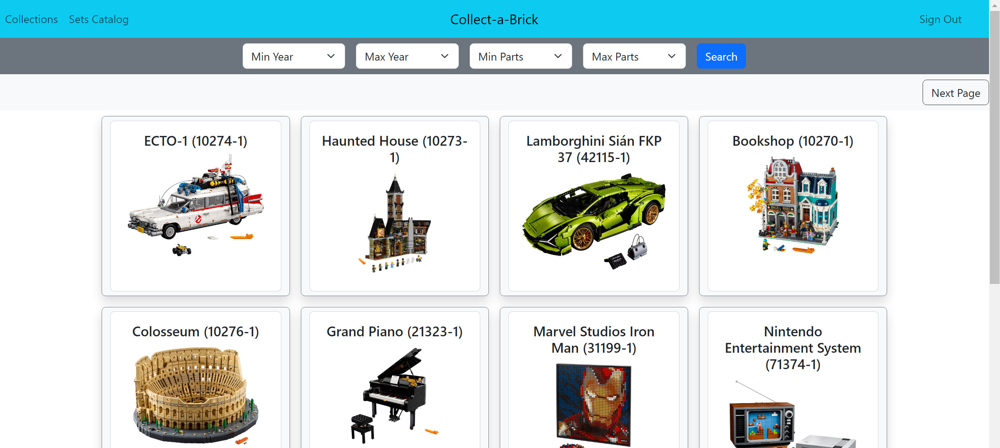

# Collect-a-Brick

## Live Link
https://collect-a-brick-d0460a9632c4.herokuapp.com/

## Overview
Collect-a-Brick is a website where you can search through Rebrickalble's Lego API for sets and then be able to add them to your collection if you're signed in. You can add or remove sets from your collection as well as make sets your favorite, moving them up in your collection.

## Languages Used
- Ruby on Rails
- CSS
- HTML
- 3rd Party Apis
- PostgreSQL

## Installation Process/Requirements
#### Make sure you have the following installed (to at least version):
- Ruby (3.2.2)
- Rails (7.1.2)
- psql (12.16)
- rbenv (1.2.0-80-gd6bb1c6)
- npm (9.8.0)
- yarn (1.22.19)
- bundle (2.4.22)
- gem (3.4.22)

Note: some of these might be automatically installed with others

#### After install run this to download dependencies
- bundle install

#### Create a config/local_env.yml and put following keys:
- API_KEY (get from https://rebrickable.com/api/)
- BASE_URI (https://rebrickable.com/api/v3/lego)
- LEGO_APP_DATABASE_PASSWORD (your set psql password)

#### Create the databases in postgres by running:
- bin/rails db:setup

## Links
### User Stories
https://trello.com/b/7rIBfSpo/capstone-project

### Wireframes
https://wireframepro.mockflow.com/editor.jsp?editor=on&spaceid=&bgcolor=white&perm=Create&pcompany=C025c51c9367945b3bcc2ae3044ff1912&ptitle=Capstone%20Project&category=featured&projectid=Mm2aZpdVNpb&publicid=016bed6a8ca84f90a5f0a2a7164c5e7b&space=default#/page/D60ea1a953a69efebdf5b0e93e04dfd68

### ERDs
https://lucid.app/lucidchart/f004ef4e-9a0e-4e6d-9bb5-93feec5b9e7f/edit?beaconFlowId=D18E85E92D24AC95&invitationId=inv_ded944c5-eb75-4435-ab73-6f62e004dd40&page=0_0#

## Screenshots

### Homepage

### Set Searchpage

### Set Collection Page

### Set Page

## Future Features
- Users can search for parts and minifigs.
- Users can add parts and minifigs to collection.
- Users can see connections between parts/sets/minifigs/themes.
- Users can buy items from there collections.